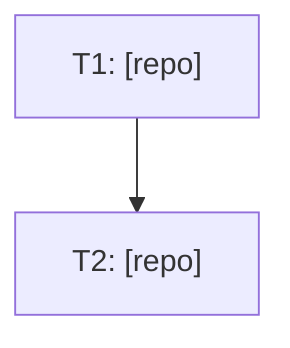

# Create User Story

Fluxo de planejamento: transforma uma thread do Slack, issue do Jira, ou descrição de feature em documentação estruturada de user story em `documentations/user_stories/<yyyyMMdd>-<slug>/`.

## Passo 1: Coletar o contexto

Se a origem for uma thread do Slack:
- Extrair channel_id e message_ts da URL: `https://genial-care.slack.com/archives/<CHANNEL>/p<TIMESTAMP>`
  - Converter timestamp: remover o `p`, inserir `.` após o 10º dígito (ex: `p1782390872587999` → `1782390872.587999`)
- Usar `tool_call` com `mcp__slack__slack_read_thread` para ler a thread completa

Se for descrição textual ou issue do Jira, usar o texto diretamente.

## Passo 2: Criar a estrutura de pastas

Formato: `documentations/user_stories/<yyyyMMdd>-<slug>/`

O slug deve ser curto e descritivo, em kebab-case, capturando a essência da feature.

Criar a pasta com `mkdir -p`.

## Passo 3: Escrever analysis.md

Estrutura do analysis.md:

```markdown
# Analysis: <título>

## Origem
Link da thread/issue, solicitante, data.

## Problema
Descrição clara do problema a ser resolvido.

## Sistemas envolvidos
Lista dos projetos impactados (clinical-panel, clinical-panel-bff, core, etc.)

## Entendimento do domínio
Explicação de como a feature funciona hoje, em linguagem de produto.

## Decisões
Decisões tomadas na thread, se houver.

## Dados técnicos relevantes
Tabelas, endpoints, use cases envolvidos.

## Perguntas em aberto
O que ainda precisa ser investigado ou decidido.
```

## Passo 4: Escrever PRD.md

Estrutura do PRD.md:

```markdown
# PRD: <título>

## Problema
Uma frase resumindo o problema.

## Solução
O que vai ser feito, em alto nível.

## Valor
Por que isso importa — impacto no negócio ou na operação.

## Critérios de aceite
Lista numerada de condições que definem "pronto".

## Fora de escopo
O que explicitamente NÃO faz parte desta user story.
```

## Passo 5 (opcional): Análise cross-repo

Se o usuário pedir para analisar os projetos envolvidos antes de decidir a solução, seguir a metodologia em `references/cross-repo-analysis.md`. Esse arquivo inclui também técnicas de context window management (subagents por repo via `delegate_task`) para investigações que envolvem 3+ repos — usar quando a leitura de código de múltiplos projetos ameaçar encher o contexto.

Para user stories que envolvem ambiente local, Docker ou orquestração cross-projetos da stack GenialCare, carregar a skill `genialcare-local-dev` — contém o mapeamento de portas, rede Docker `genial`, configuração de environment por projeto (core/bff/painel), fluxos de dados local vs hybrid, o padrão de Makefile orquestrador com targets product-prefixed (clinical-up, operational-up, etc.), e problemas técnicos conhecidos (CORS, Auth0, hostname mismatch, Vite env precedence).

## Passo 6 (opcional): Escrever todo.md

Se o usuário pedir explicitamente um todo.md (ou quando a story já sai pronta para execução, não só planejamento), seguir o formato de execução vertical:

```markdown
# Todo: <título>

## Grafo de Dependências



## Fatia N: <nome da fatia>

- [ ] **T1 — [repo] <título da task>**
  - Arquivo(s): caminho(s) exato(s)
  - Mudança: diff ou descrição da mudança
  - Dependências: nenhuma / T-anterior
  - Critérios de aceite: lista de checkboxes
  - **Estado:**
    - exec_status: pending
    - pr: —
    - commit: —
    - validated: —
    - iterations: 0
    - findings: —
```

### Seção de Notas (opcional)

O todo.md pode ter uma seção `## Notas` ao final, para documentar problemas conhecidos encontrados durante a investigação que **não viram tasks** mas são importantes para quem for executar:

```markdown
## Notas

- **CORS do core para localhost:5050**: o `cors.rb` libera `http://localhost:5050` apenas quando `SERVER_ENV=development`. Se o fluxo de auth falhar com erro de CORS durante a T4, adicionar `SERVER_ENV=development` ao `.env.development` do core é o fix trivial. Fica fora das tasks pois o usuário pediu para não mexer no core preemptivamente.
- **Firestore no painel**: o SDK do Firebase no browser pode estar apontando para o Firestore na GCP em vez do emulador local. Se causar inconsistências, investigar como configurar o SDK para apontar para o emulador local.
```

Isso reforça a regra "não crie task para cada bug irmão" — dando a esses bugs latentes um lugar documentado sem inflar o todo.md.

Regras de disciplina de escopo (aprendidas por correção direta do usuário — aplicar por padrão, não esperar o usuário pedir de novo):

- **Não crie uma task para cada bug irmão encontrado.** Se a investigação revelar um segundo local com o mesmo padrão de bug mas sem relato de crash real, registre como **nota** no analysis.md ("bug latente, fora de escopo desta story") — não vire task no todo.md.
- **Não adicione task de "validação end-to-end" por padrão.** Muitos usuários preferem validar manualmente. Só inclua se o usuário pedir explicitamente.
- **Não fragmente uma única unidade de trabalho em múltiplas tasks.** Fix + teste no mesmo arquivo/mesmo PR é uma task só. Separe em tasks distintas apenas quando há dependência real entre arquivos/repos diferentes, ou quando podem ser executadas em paralelo por PRs diferentes.
- **Ao remover uma task por pedido do usuário**, atualize também o grafo Mermaid (remova o nó e as arestas que dependiam dele) — não deixe nó órfão.
- Espere iteração: é comum o usuário revisar o todo.md em 2-3 rounds reduzindo escopo depois de vê-lo pronto. Aplique cada correção imediatamente e por completo (todo.md + qualquer menção equivalente no PRD.md/analysis.md), sem esperar acumular pedidos.

## Pitfall adicional: investigação como prequel

Às vezes o usuário pede para investigar primeiro e depois criar a user story. Nesse caso:

1. A fase de investigação (Passo 5/cross-repo-analysis) acontece **como prequel**, e os resultados são incorporados ao `analysis.md` na seção "Entendimento do domínio" e "Dados técnicos relevantes".
2. O todo.md pode incluir tasks em múltiplos repos mesmo quando a investigação foi feita por subagentes separados — o grafo de dependências (Mermaid) ajuda a visualizar qual task bloqueia qual.
3. Problemas técnicos descobertos na investigação que o usuário pediu para não resolver preemptivamente (ex: "não mexa no core por enquanto") devem ir na seção de Notas do todo.md, não virar tasks.

## Pitfalls

- **`clarify()` sem resposta a tempo**: quando uma pergunta de clarify sobre escopo não recebe resposta (timeout), não bloquear a sessão. Prosseguir com a leitura mais literal/direta do pedido original do usuário, registrar a decisão explicitamente na seção "Decisões" do analysis.md (ex.: "Como não recebi resposta ao clarify, segui com X"), e no final da resposta ao usuário destacar claramente qual suposição foi assumida e convidar para ajustar. Nunca escrever os docs como se a confirmação tivesse ocorrido — deixar rastreável que foi uma decisão de melhor julgamento.
- **Slack message_ts**: o formato da URL é `p<unix_microseconds>`. Converter inserindo `.` após o 10º dígito.
- **Skill não existe**: se o comando delegar para uma skill que não existe, fazer manualmente seguindo este workflow. Reportar o gap.
- **Projetos via symlink**: os repos irmãos ficam em `projects/` (symlinks). Rodar `./sync.sh` se não estiverem disponíveis.
- **Escopo claro**: se a discussão original tem múltiplas frentes, confirmar com o usuário quais entram na story e quais ficam de fora. Remover as frentes descartadas dos docs.
- **Não confundir ideal com prático**: quando o problema envolve métricas com duas bases de cálculo (ex: prescrito vs agendado), a story deve deixar claro qual é qual e qual está no escopo. Validar o entendimento com o usuário antes de escrever.
- **Meta a perseguir vs métrica descritiva — não force todo valor calculado a virar um registro com histórico.** Antes de modelar um número novo como uma entidade com histórico de mudança (ex: `Workload`/`ClinicalCaseWorkload` no domínio GenialCare — usado para metas prescritas, com `in_effect_since`/`change_reason`), perguntar: esse valor é algo que alguém decidiu como objetivo a alcançar, ou é só um reflexo automático de dados que já existem (agenda, progresso)? Se for descritivo, **não persistir em lugar nenhum** — calcular sob demanda a partir dos dados-fonte, sem workload novo, sem coluna com histórico, sem rake de backfill. O usuário corrigiu essa direção explicitamente numa investigação de 2026-08-26 (métrica de HBJ "factível" vs a "ideal" já existente): criar um `workload_type` novo comunicaria "isso é uma meta", quando o objetivo era o oposto. Só persistir um valor calculado (ex: em `ClinicalCasePreferences`) quando os inputs são estáveis o suficiente para não exigir escuta de múltiplos eventos de invalidação — se depende de 2+ fontes voláteis sem evento único de sincronização, é sinal de "calcular on-the-fly", não "persistir e manter sincronizado".
- **Eliminar duplicação de regra de negócio movendo constantes para o banco, não só escolhendo "onde calcular".** Quando threads de análise cross-repo (Core/BFF/Frontend) esbarram em "se calcular no BFF/frontend, duplico uma tabela/constante que já existe no Core" (ex: percentuais fixos por categoria), a solução não é sempre "calcular tudo no Core" (endpoint novo, mais deploy) nem "aceitar a duplicação" — considerar se a constante é dado de configuração (muda raramente, por decisão de negócio) que pode virar coluna/atributo persistido no model já existente (ex: mover `MODULE_PERCENTAGES` de uma constante Ruby hardcoded para uma coluna em `PeiModule`). Isso: (a) remove a duplicação sem endpoint novo, (b) torna o valor editável sem deploy, (c) dá uma fonte de verdade única que qualquer camada pode ler. Buscar precedentes reais de precisão/tipo de coluna no repo (`grep` por migrations recentes com `:decimal, precision:`) antes de propor o tipo da coluna nova.
- **Esperar revisão iterativa de decisões arquiteturais, não só de escopo do todo.md.** Além da iteração já documentada sobre reduzir escopo do todo.md, o usuário também revisita decisões de modelagem já feitas (ex: "vou persistir isso" → "não, na real acho que não deveria") no meio da mesma investigação. Tratar cada objeção como reabertura legítima do trade-off (nunca "já decidimos isso"), atualizar a análise (`analysis.md`) incrementalmente conforme a decisão evolui, e só gerar `todo.md`/plano de execução depois que a decisão de modelagem parece estabilizada — sinalizado pelo próprio usuário dizendo algo como "acho que chegamos num bom meio-termo".
- **Backfill/seed pontual de poucos registros → script de console, não rake.** Quando uma task do todo.md envolve popular um valor novo em poucos registros existentes (ex: 3 módulos por tenant), não formalizar automaticamente como uma rake task (`lib/tasks/*.rake`) só porque existe a skill `rake` no repo — perguntar/assumir primeiro se o volume e a natureza (rodar uma vez, manualmente, não reaproveitável) justificam isso, ou se um script simples para colar no `rails console`/`rails runner` já resolve. O usuário corrigiu isso explicitamente numa investigação de 2026-08-26: "a task de popular o pei_module pode ser um script simples para eu rodar no console. Não precisa formalizar em uma rake." Regra prática: se a task já é descrita como "rodar uma vez após o deploy" (não recorrente, não parametrizada para diferentes inputs), prefira o script de console — documentado inline no PR ou no próprio todo.md, sem `.rake` dedicado. Combinar com a regra de multi-tenant: usar `find_by` (não `find_by!`) por registro esperado, `next unless registro` para pular sem erro quando não existir naquele tenant, e não interromper a iteração dos demais tenants por causa de um ausente.
- **Slug descritivo**: evitar slugs genéricos. Se o escopo mudar durante a criação, renomear a pasta (`mv`). Ex: `metrica-hbj-historica` → `hbj-horas-agendadas-painel`.
- **Manter docs sincronizados**: se o escopo mudar, atualizar analysis.md, PRD.md e todo.md juntos — não deixe um dos três desatualizado.
- **User story dentro de iniciativa existente**: se o bug/feature é continuação direta de uma iniciativa já documentada (ver `documentations/initiatives/<nome>/`), criar a nova user story dentro dela (`documentations/initiatives/<nome>/user_stories/<slug>/`) em vez de em `documentations/user_stories/` solto.
- **Isolamento de commits ao abrir PRs**: quando o repo product-engineer-agent tem staged changes de outras user stories (ex: `20260819-*`), NÃO incluí-las no commit da story atual. Fazer `git reset HEAD` para desstagear tudo, depois `git add` apenas os arquivos da story corrente antes de commitar. Cada PR deve conter só mudanças relevantes à sua própria feature. O usuário corrigiu isso explicitamente: "toma cuidado para que o PR tenha coisas apenas a ver com o que fizemos aqui". Docs de user story (analysis.md, PRD.md, todo.md) vão direto na `main` do product-engineer-agent, não no PR.
- **`git rebase --continue` abre editor interativo**: ao resolver conflitos de rebase, `git rebase --continue` abre `vim`/`nano` para editar a mensagem de commit, o que trava o terminal em modo não-interativo (timeout de 60s). Usar `GIT_EDITOR=true git rebase --continue` para pular o editor e aceitar a mensagem original.
- **Comentários inline em arquivos dotenv**: comentários dentro de aspas duplas (ex: `VAR="value  # comment"`) são interpretados como parte do valor. Pôr comentários em linha separada acima da variável. Detectado pelo gemini-code-assist na review do PR.
- **"Organize os arquivos em commits e dê push" com múltiplas stories soltas no working tree**: quando o usuário pede para organizar um `git status` bagunçado (vários discoveries/features/user_stories/error-analysis misturados, staged e untracked), não faça um commit único. Primeiro rode `git reset` para desstagear tudo, depois investigue cada grupo de arquivos (por pasta/tema) com `git diff`/`diff` contra o índice para entender se são independentes entre si — preste atenção a arquivos `.tmp` que na verdade são o par de um rename detectável pelo git (`git add -A` já casa `X.md.tmp` deletado com `X.md` novo como rename, sem precisar tratar manualmente). Depois `git add` só os arquivos de cada grupo e commite em mensagens `docs(escopo): resumo` separadas — um commit por discovery/feature/user-story/error-analysis, na ordem que fizer sentido para a leitura do histórico. Isso segue a mesma lógica de "isolamento de commits" já documentada acima, mas para o caso de organizar retroativamente, não durante a criação.
- **Push para `main` rejeitado (`! [rejected] main -> main (fetch first)`)**: como muitos docs deste repo vão direto pra `main` (sem PR), é comum o remoto ter avançado com commits de outras pessoas entre o início da sessão e o `git push`. Como as mudanças costumam ser pastas/arquivos disjuntos (cada discovery/user-story em sua própria pasta), o fix é `git fetch origin main && git rebase origin/main && git push origin main` — o rebase tende a aplicar limpo sem conflito. Só cair para merge/resolução manual se o rebase reportar conflito de verdade.
- **CSV derivado de planilha — nunca "corrigir" o CSV direto; a planilha é a fonte da verdade.** Quando o dado (ex: de-para de objetivos, mapper de TO) vem de um CSV exportado de Google Sheets, editar o CSV versionado para arrumar um dado deixa a planilha errada e o problema regressa no próximo export. O usuário corrigiu isso explicitamente ("não quero que corrija o CSV, pois a planilha vai continuar errada e na próxima vez que precisar puxar de lá vai dar ruim"). Fluxo correto: (1) reportar os problemas exatos — nome completo do objetivo/item e texto atual vs. esperado, **sem abreviar com "…"**; (2) o usuário corrige na planilha; (3) ele re-exporta; (4) revisar o CSV novo por diff/parse (não por inspeção visual — detectar células malformadas escaneando por múltiplos prefixos de item na mesma linha, e checar resíduo de separador `;`/`.` no fim de item), e só então substituir o versionado. Ao substituir, normalizar CRLF→LF e remover BOM para manter a convenção do repo. Aviso: o usuário pode subir o arquivo com sufixo `(1)` quando o upload duplica — procurar pelo arquivo `(1)` antes de concluir que nada mudou.
