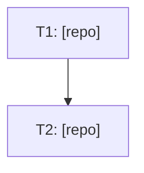

# Create User Story

Fluxo de planejamento: transforma uma thread do Slack, issue do Jira, ou descrição de feature em documentação estruturada de user story em `documentations/user_stories/<yyyyMMdd>-<slug>/`.

## Passo 1: Coletar o contexto

Se a origem for uma thread do Slack:
- Extrair channel_id e message_ts da URL: `https://genial-care.slack.com/archives/<CHANNEL>/p<TIMESTAMP>`
  - Converter timestamp: remover o `p`, inserir `.` após o 10º dígito (ex: `p1782390872587999` → `1782390872.587999`)
- Usar `tool_call` com `mcp__slack__slack_read_thread` para ler a thread completa

Se for descrição textual ou issue do Jira, usar o texto diretamente.

## Passo 2: Criar a estrutura de pastas

Formato: `documentations/user_stories/<yyyyMMdd>-<slug>/`

O slug deve ser curto e descritivo, em kebab-case, capturando a essência da feature.

Criar a pasta com `mkdir -p`.

## Passo 3: Escrever analysis.md

Estrutura do analysis.md:

```markdown
# Analysis: <título>

## Origem
Link da thread/issue, solicitante, data.

## Problema
Descrição clara do problema a ser resolvido.

## Sistemas envolvidos
Lista dos projetos impactados (clinical-panel, clinical-panel-bff, core, etc.)

## Entendimento do domínio
Explicação de como a feature funciona hoje, em linguagem de produto.

## Decisões
Decisões tomadas na thread, se houver.

## Dados técnicos relevantes
Tabelas, endpoints, use cases envolvidos.

## Perguntas em aberto
O que ainda precisa ser investigado ou decidido.
```

## Passo 4: Escrever PRD.md

Estrutura do PRD.md:

```markdown
# PRD: <título>

## Problema
Uma frase resumindo o problema.

## Solução
O que vai ser feito, em alto nível.

## Valor
Por que isso importa — impacto no negócio ou na operação.

## Critérios de aceite
Lista numerada de condições que definem "pronto".

## Fora de escopo
O que explicitamente NÃO faz parte desta user story.
```

## Passo 5 (opcional): Análise cross-repo

Se o usuário pedir para analisar os projetos envolvidos antes de decidir a solução, seguir a metodologia em `references/cross-repo-analysis.md`. Esse arquivo inclui também técnicas de context window management (subagents por repo via `delegate_task`) para investigações que envolvem 3+ repos — usar quando a leitura de código de múltiplos projetos ameaçar encher o contexto.

Para features no **app mobile** (`mobile` / `mobile-bff` / `core`, em vez de `clinical-panel`), ver `references/mobile-stack-analysis.md` — cobre o padrão de mapeamento status→categoria centralizado no BFF e o pitfall de design "valor em mais de um grupo" (flag booleano aditivo vs. lista).

Para decisões de escopo que dependem de **quantos registros são afetados** (grandfathering, data de corte, rollout gradual, dimensionamento de backfill), embasar a recomendação com dados reais de produção (read-only) antes de escrever os docs — ver `references/production-data-for-scoping.md` (invocação do rails runner via kubectl, iteração por tenant, cohorts de borda que decidem o critério).

Para mudanças nas **regras de carga horária (workload)** no core/bff/panel — matrizes por operadora, limiting, carga default de contrato — ver `references/workload-rules-analysis.md` (limite por total vs por item, caminhos que criam workload, identificação de operadora no lado clínico, flag de regime).

Para stories que **criam ou alteram mensagens de erro** vistas no clinical-panel — ver `references/genialcare-error-messages.md` (pipeline pt-BR I18n do core, repasse de `Accept-Language` pelo BFF, formato `{details: [...]}`, bugs comuns no branch de erro dos controllers).

Para user stories que envolvem ambiente local, Docker ou orquestração cross-projetos da stack GenialCare, carregar a skill `genialcare-local-dev` — contém o mapeamento de portas, rede Docker `genial`, configuração de environment por projeto (core/bff/painel), fluxos de dados local vs hybrid, o padrão de Makefile orquestrador com targets product-prefixed (clinical-up, operational-up, etc.), e problemas técnicos conhecidos (CORS, Auth0, hostname mismatch, Vite env precedence).

## Passo 6 (opcional): Escrever todo.md

Se o usuário pedir explicitamente um todo.md (ou quando a story já sai pronta para execução, não só planejamento), seguir o formato de execução vertical:

```markdown
# Todo: <título>

## Grafo de Dependências



## Fatia N: <nome da fatia>

- [ ] **T1 — [repo] <título da task>**
  - Arquivo(s): caminho(s) exato(s)
  - Mudança: diff ou descrição da mudança
  - Dependências: nenhuma / T-anterior
  - Critérios de aceite: lista de checkboxes
  - **Estado:**
    - exec_status: pending
    - pr: —
    - commit: —
    - validated: —
    - iterations: 0
    - findings: —
```

### Seção de Notas (opcional)

O todo.md pode ter uma seção `## Notas` ao final, para documentar problemas conhecidos encontrados durante a investigação que **não viram tasks** mas são importantes para quem for executar:

```markdown
## Notas

- **CORS do core para localhost:5050**: o `cors.rb` libera `http://localhost:5050` apenas quando `SERVER_ENV=development`. Se o fluxo de auth falhar com erro de CORS durante a T4, adicionar `SERVER_ENV=development` ao `.env.development` do core é o fix trivial. Fica fora das tasks pois o usuário pediu para não mexer no core preemptivamente.
- **Firestore no painel**: o SDK do Firebase no browser pode estar apontando para o Firestore na GCP em vez do emulador local. Se causar inconsistências, investigar como configurar o SDK para apontar para o emulador local.
```

Isso reforça a regra "não crie task para cada bug irmão" — dando a esses bugs latentes um lugar documentado sem inflar o todo.md.

Regras de disciplina de escopo (aprendidas por correção direta do usuário — aplicar por padrão, não esperar o usuário pedir de novo):

- **Não crie uma task para cada bug irmão encontrado.** Se a investigação revelar um segundo local com o mesmo padrão de bug mas sem relato de crash real, registre como **nota** no analysis.md ("bug latente, fora de escopo desta story") — não vire task no todo.md.
- **Não adicione task de "validação end-to-end" por padrão.** Muitos usuários preferem validar manualmente. Só inclua se o usuário pedir explicitamente.
- **Não fragmente uma única unidade de trabalho em múltiplas tasks.** Fix + teste no mesmo arquivo/mesmo PR é uma task só. Separe em tasks distintas apenas quando há dependência real entre arquivos/repos diferentes, ou quando podem ser executadas em paralelo por PRs diferentes.
- **Ao remover uma task por pedido do usuário**, atualize também o grafo Mermaid (remova o nó e as arestas que dependiam dele) — não deixe nó órfão.
- Espere iteração: é comum o usuário revisar o todo.md em 2-3 rounds reduzindo escopo depois de vê-lo pronto. Aplique cada correção imediatamente e por completo (todo.md + qualquer menção equivalente no PRD.md/analysis.md), sem esperar acumular pedidos.

## Pitfall adicional: investigação como prequel

Às vezes o usuário pede para investigar primeiro e depois criar a user story. Nesse caso:

1. A fase de investigação (Passo 5/cross-repo-analysis) acontece **como prequel**, e os resultados são incorporados ao `analysis.md` na seção "Entendimento do domínio" e "Dados técnicos relevantes".
2. O todo.md pode incluir tasks em múltiplos repos mesmo quando a investigação foi feita por subagentes separados — o grafo de dependências (Mermaid) ajuda a visualizar qual task bloqueia qual.
3. Problemas técnicos descobertos na investigação que o usuário pediu para não resolver preemptivamente (ex: "não mexa no core por enquanto") devem ir na seção de Notas do todo.md, não virar tasks.

**Documentar durante o processo, não só no final.** Quando o usuário pede para "vá documentando tudo durante o seu processo" (ou atua com autonomia prolongada numa investigação), escrever os docs incrementalmente conforme cada frente de investigação fecha (anatomy do domínio → depois a análise de cada decisão em aberto), em vez de acumular tudo na cabeça e escrever no fim. Motivos: (a) o usuário pode ler os docs no meio do caminho e redirecionar antes do esforço completo; (b) descobertas intermediárias (números de produção, nomes reais de planos, precedentes) ficam persistidas mesmo se o contexto degrada; (c) o analysis.md final nasce por acumulação de seções já revisadas, não de um dump único. Subagent reports que chegam depois podem ser incorporados por patch nos docs já escritos (consistência entre os três docs mantida incrementalmente).

## Revisão de user story antes de enviar para review (anti-contestação)

Quando o usuário pedir para "revisar com diligência" uma story complexa antes do review — com
pedidos como "sem margem para dúvidas/contestações", "iterar no mínimo 3x", "atue com
independência" — aplicar estes checks. A regra de ouro: **validar claims técnicos contra o código
real (core/bff/panel), nunca confiar no que o doc afirma**.

1. **Verificar claims no código/banco.** Abrir models/migrations reais e conferir: nullability de
   FK (`protocol_item_id` NOT NULL?), associações polimórficas (`protocol_item_type`), `has_one
   :pei`, scopes citados (`Objective.by_clinical_case`), e enums (ex: bater
   `ExpressiveCommunicationFeatureName` com "9 funções" que o doc cita). Confirmar o precedente
   (ex: Vineland `SubdomainItemScore → objectives`). Se o doc cita "duas definições de X no BFF",
   confirmar no schema (`grep`).
2. **Termo sobrecarregado gera contestação.** Um termo com dois sentidos (ex: "materializar" = o
   de-para estático **é** materializado, mas a relação por avaliação **não é** — resolve-se
   on-the-fly) confunde revisor. Clarificar os dois sentidos logo no topo da seção que trata do
   assunto.
3. **Catálogo vs instância.** Quando o de-para aponta para o **Library Objective (catálogo)** e
   não para o **Objective do PEI (instância)**, o status "não iniciado" é **sintetizado na UI**
   (core devolve `status: null`), e **não** é valor do enum `ObjectiveStatuses`. O PRD costuma
   dizer "objetivos do PEI" quando o correto é "Library Objectives do catálogo". Checar o
   protótipo (ex: `STATUS_DEFAULT`) para resolver a ambiguidade de UX — ele é a fonte de verdade
   do comportamento exibido.
4. **Critérios de aceite contra o comportamento real.** Revisar cada critério nos casos de borda
   (sem de-para, sem PEI, sem objetivos). Um critério como "caso sem PEI retorna mapa vazio" pode
   estar errado — o correto pode ser "retorna o catálogo com status nulo". Corrija o critério,
   não deixe a contradição entre PRD/todo/analysis.
5. **"Perguntas em aberto" que já foram resolvidas.** Se o doc tem uma seção "Perguntas em
   aberto" mas as seções de trade-offs já dão recomendação fundamentada, reframe como "Decisões
   recomendadas (aguardando confirmação)" apontando para cada trade-off — senão o revisor contesta
   "por que isso ainda está aberto?".
6. **Decisão central ausente do PRD.** A decisão mais importante (ex: não materializar a relação)
   às vezes está só no `analysis.md` (doc profundo). O PRD (doc executivo, que o revisor lê
   primeiro) precisa resumir as decisões-chave — incluindo o "porquê" — senão um revisor que só lê
   o PRD contesta algo que já foi decidido.
7. **Permissionamento OpenFGA (ADR 0019).** Endpoint/display novo: **não decidir** action/field
   nova unilateralmente. Default conservador é reusar a policy de leitura existente; FLAG como
   decisão a confirmar com o usuário (o CLAUDE.md manda perguntar antes de montar fatias).
8. **Conferir a aritmética de qualquer soma/total citado.** Erros como "11/2/2 = 16h" (o
   correto: 15h) passam despercebidos e viram contestação. Recompute todo total de matriz,
   distribuição e exemplo. Ao citar uma distribuição de produção, confira a QUAL matriz/regra
   cada número corresponde — um pico atribuído à matriz errada (11h totais é a moderada
   7/2/2, não a severa 11/2/2) mina a análise inteira.
9. **Re-ler o doc INTEIRO após rodadas de decisão iterativa.** Decisões tomadas em rodadas
   deixam trechos defasados: "Regras de negócio" ainda dizendo "a decidir" para o que já foi
   decidido; seção de análise ainda recomendando o que o usuário descartou; numeração de
   decisões com saltos (ex.: 5 → 10); referências cruzadas apontando para números antigos;
   frases inacabadas ("na verdade..."). Sessão 2026-09-30: essa releitura final pegou 7
   pontos defasados num doc de ~400 linhas que já tinha passado por 4 rodadas de revisão.
10. **Story que toca mensagens de erro: rastrear o pipeline ponta a ponto.** Core use case
    (I18n com `default:` inglês) → branch de erro do controller (renderiza mesmo? já
    existia bug de copy-paste renderizando variável nil de outro domínio — o 422 virava
    500) → repasse de headers no BFF (`Accept-Language` não era repassado — pipeline de
    tradução morto mesmo com I18n implantado) → extração no frontend
    (`body.details[0].errors[0].message`). Uma mudança "pequena" de mensagem pode estar
    bloqueada por um elo do meio quebrado. Pipeline completo:
    `references/genialcare-error-messages.md`.

Mantém-se a exigência de **consistência entre os três docs** (PRD.md, analysis.md, todo.md): toda
correção aplicada num deles deve ser refletida nos outros dois.

## Pitfalls

- **`clarify()` sem resposta a tempo**: quando uma pergunta de clarify sobre escopo não recebe resposta (timeout), não bloquear a sessão. Prosseguir com a leitura mais literal/direta do pedido original do usuário, registrar a decisão explicitamente na seção "Decisões" do analysis.md (ex.: "Como não recebi resposta ao clarify, segui com X"), e no final da resposta ao usuário destacar claramente qual suposição foi assumida e convidar para ajustar. Nunca escrever os docs como se a confirmação tivesse ocorrido — deixar rastreável que foi uma decisão de melhor julgamento.
- **Slack message_ts**: o formato da URL é `p<unix_microseconds>`. Converter inserindo `.` após o 10º dígito.
- **Skill não existe**: se o comando delegar para uma skill que não existe, fazer manualmente seguindo este workflow. Reportar o gap.
- **Projetos via symlink**: os repos irmãos ficam em `projects/` (symlinks). Rodar `./sync.sh` se não estiverem disponíveis.
- **Escopo claro**: se a discussão original tem múltiplas frentes, confirmar com o usuário quais entram na story e quais ficam de fora. Remover as frentes descartadas dos docs.
- **Não confundir ideal com prático**: quando o problema envolve métricas com duas bases de cálculo (ex: prescrito vs agendado), a story deve deixar claro qual é qual e qual está no escopo. Validar o entendimento com o usuário antes de escrever.
- **Meta a perseguir vs métrica descritiva — não force todo valor calculado a virar um registro com histórico.** Antes de modelar um número novo como uma entidade com histórico de mudança (ex: `Workload`/`ClinicalCaseWorkload` no domínio GenialCare — usado para metas prescritas, com `in_effect_since`/`change_reason`), perguntar: esse valor é algo que alguém decidiu como objetivo a alcançar, ou é só um reflexo automático de dados que já existem (agenda, progresso)? Se for descritivo, **não persistir em lugar nenhum** — calcular sob demanda a partir dos dados-fonte, sem workload novo, sem coluna com histórico, sem rake de backfill. O usuário corrigiu essa direção explicitamente numa investigação de 2026-08-26 (métrica de HBJ "factível" vs a "ideal" já existente): criar um `workload_type` novo comunicaria "isso é uma meta", quando o objetivo era o oposto. Só persistir um valor calculado (ex: em `ClinicalCasePreferences`) quando os inputs são estáveis o suficiente para não exigir escuta de múltiplos eventos de invalidação — se depende de 2+ fontes voláteis sem evento único de sincronização, é sinal de "calcular on-the-fly", não "persistir e manter sincronizado".
- **Eliminar duplicação de regra de negócio movendo constantes para o banco, não só escolhendo "onde calcular".** Quando threads de análise cross-repo (Core/BFF/Frontend) esbarram em "se calcular no BFF/frontend, duplico uma tabela/constante que já existe no Core" (ex: percentuais fixos por categoria), a solução não é sempre "calcular tudo no Core" (endpoint novo, mais deploy) nem "aceitar a duplicação" — considerar se a constante é dado de configuração (muda raramente, por decisão de negócio) que pode virar coluna/atributo persistido no model já existente (ex: mover `MODULE_PERCENTAGES` de uma constante Ruby hardcoded para uma coluna em `PeiModule`). Isso: (a) remove a duplicação sem endpoint novo, (b) torna o valor editável sem deploy, (c) dá uma fonte de verdade única que qualquer camada pode ler. Buscar precedentes reais de precisão/tipo de coluna no repo (`grep` por migrations recentes com `:decimal, precision:`) antes de propor o tipo da coluna nova.
- **Esperar revisão iterativa de decisões arquiteturais, não só de escopo do todo.md.** Além da iteração já documentada sobre reduzir escopo do todo.md, o usuário também revisita decisões de modelagem já feitas (ex: "vou persistir isso" → "não, na real acho que não deveria") no meio da mesma investigação. Tratar cada objeção como reabertura legítima do trade-off (nunca "já decidimos isso"), atualizar a análise (`analysis.md`) incrementalmente conforme a decisão evolui, e só gerar `todo.md`/plano de execução depois que a decisão de modelagem parece estabilizada — sinalizado pelo próprio usuário dizendo algo como "acho que chegamos num bom meio-termo".
- **Backfill/seed pontual de poucos registros → script de console, não rake.** Quando uma task do todo.md envolve popular um valor novo em poucos registros existentes (ex: 3 módulos por tenant), não formalizar automaticamente como uma rake task (`lib/tasks/*.rake`) só porque existe a skill `rake` no repo — perguntar/assumir primeiro se o volume e a natureza (rodar uma vez, manualmente, não reaproveitável) justificam isso, ou se um script simples para colar no `rails console`/`rails runner` já resolve. O usuário corrigiu isso explicitamente numa investigação de 2026-08-26: "a task de popular o pei_module pode ser um script simples para eu rodar no console. Não precisa formalizar em uma rake." Regra prática: se a task já é descrita como "rodar uma vez após o deploy" (não recorrente, não parametrizada para diferentes inputs), prefira o script de console — documentado inline no PR ou no próprio todo.md, sem `.rake` dedicado. Combinar com a regra de multi-tenant: usar `find_by` (não `find_by!`) por registro esperado, `next unless registro` para pular sem erro quando não existir naquele tenant, e não interromper a iteração dos demais tenants por causa de um ausente.
- **Slug descritivo**: evitar slugs genéricos. Se o escopo mudar durante a criação, renomear a pasta (`mv`). Ex: `metrica-hbj-historica` → `hbj-horas-agendadas-painel`.
- **Manter docs sincronizados**: se o escopo mudar, atualizar analysis.md, PRD.md e todo.md juntos — não deixe um dos três desatualizado.
- **User story dentro de iniciativa existente**: se o bug/feature é continuação direta de uma iniciativa já documentada (ver `documentations/initiatives/<nome>/`), criar a nova user story dentro dela (`documentations/initiatives/<nome>/user_stories/<slug>/`) em vez de em `documentations/user_stories/` solto.
- **Isolamento de commits ao abrir PRs**: quando o repo product-engineer-agent tem staged changes de outras user stories (ex: `20260819-*`), NÃO incluí-las no commit da story atual. Fazer `git reset HEAD` para desstagear tudo, depois `git add` apenas os arquivos da story corrente antes de commitar. Cada PR deve conter só mudanças relevantes à sua própria feature. O usuário corrigiu isso explicitamente: "toma cuidado para que o PR tenha coisas apenas a ver com o que fizemos aqui". Docs de user story (analysis.md, PRD.md, todo.md) vão direto na `main` do product-engineer-agent, não no PR.
- **`git rebase --continue` abre editor interativo**: ao resolver conflitos de rebase, `git rebase --continue` abre `vim`/`nano` para editar a mensagem de commit, o que trava o terminal em modo não-interativo (timeout de 60s). Usar `GIT_EDITOR=true git rebase --continue` para pular o editor e aceitar a mensagem original.
- **Comentários inline em arquivos dotenv**: comentários dentro de aspas duplas (ex: `VAR="value  # comment"`) são interpretados como parte do valor. Pôr comentários em linha separada acima da variável. Detectado pelo gemini-code-assist na review do PR.
- **"Organize os arquivos em commits e dê push" com múltiplas stories soltas no working tree**: quando o usuário pede para organizar um `git status` bagunçado (vários discoveries/features/user_stories/error-analysis misturados, staged e untracked), não faça um commit único. Primeiro rode `git reset` para desstagear tudo, depois investigue cada grupo de arquivos (por pasta/tema) com `git diff`/`diff` contra o índice para entender se são independentes entre si — preste atenção a arquivos `.tmp` que na verdade são o par de um rename detectável pelo git (`git add -A` já casa `X.md.tmp` deletado com `X.md` novo como rename, sem precisar tratar manualmente). Depois `git add` só os arquivos de cada grupo e commite em mensagens `docs(escopo): resumo` separadas — um commit por discovery/feature/user-story/error-analysis, na ordem que fizer sentido para a leitura do histórico. Isso segue a mesma lógica de "isolamento de commits" já documentada acima, mas para o caso de organizar retroativamente, não durante a criação.
- **Push para `main` rejeitado (`! [rejected] main -> main (fetch first)`)**: como muitos docs deste repo vão direto pra `main` (sem PR), é comum o remoto ter avançado com commits de outras pessoas entre o início da sessão e o `git push`. Como as mudanças costumam ser pastas/arquivos disjuntos (cada discovery/user-story em sua própria pasta), o fix é `git fetch origin main && git rebase origin/main && git push origin main` — o rebase tende a aplicar limpo sem conflito. Só cair para merge/resolução manual se o rebase reportar conflito de verdade.
- **CSV derivado de planilha — nunca "corrigir" o CSV direto; a planilha é a fonte da verdade.** Quando o dado (ex: de-para de objetivos, mapper de TO) vem de um CSV exportado de Google Sheets, editar o CSV versionado para arrumar um dado deixa a planilha errada e o problema regressa no próximo export. O usuário corrigiu isso explicitamente ("não quero que corrija o CSV, pois a planilha vai continuar errada e na próxima vez que precisar puxar de lá vai dar ruim"). Fluxo correto: (1) reportar os problemas exatos — nome completo do objetivo/item e texto atual vs. esperado, **sem abreviar com "…"**; (2) o usuário corrige na planilha; (3) ele re-exporta; (4) revisar o CSV novo por diff/parse (não por inspeção visual — detectar células malformadas escaneando por múltiplos prefixos de item na mesma linha, e checar resíduo de separador `;`/`.` no fim de item), e só então substituir o versionado. Ao substituir, normalizar CRLF→LF e remover BOM para manter a convenção do repo. Aviso: o usuário pode subir o arquivo com sufixo `(1)` quando o upload duplica — procurar pelo arquivo `(1)` antes de concluir que nada mudou.
- **Regra com cohort/grandfathering: codificar o cohort no NOME.** Quando a regra vale só para um cohort (ex.: famílias pós-cutoff), nomear classes/flags/constantes com o cohort embutido (`NewAmilWorkload`, `NewAmilRegime`, `enable_new_amil_workload_rule`, `NEW_AMIL_WORKLOAD_RULE_CUTOFF`) — o nome é a primeira defesa contra alguém, no futuro, despachar só por plano e aplicar a regra a um caso legado. Framing positivo (`New*`) > dupla negativa (`NonLegacy*`, que exige salto mental e importa jargão inexistente no codebase). Proposta do próprio usuário na sessão 2026-09-30 ("ter algo que especifique melhor que é apenas para casos novos"). Registrar as alternativas rejeitadas na decisão (`AmilV2*` ambíguo quando houver V3 do acordo, etc.).
- **Matcher por nome de plano/variante é decisão de negócio, não cobertura defensiva.** Quando a story identificar operadora/plano por nome (ex: `General::InsuranceHealthPlan` no lado clínico), não inclua defensivamente nomes parecidos — variantes podem ser produtos deliberadamente diferentes (correção de 2026-09-30 na story Amil: "Faz a regra apenas para Amil. Pois Amil One é plano premium que não entra na mesma regra"). O nome clínico é snapshot congelado por caso (sync copia na criação; renomeação do plano deixa nome legado em casos antigos — "Amil One" em produção era exatamente isso). Antes de fechar o matcher: perguntar quais variantes entram e verificar em produção se o plano finance da variante existe/está ativo (plano finance inativo não gera novos casos clínicos com aquele nome — o matcher exato fica seguro). Detalhes do domínio em `references/workload-rules-analysis.md`.
- **Rodadas de decisão: perguntas numeradas, opções preservadas, decisão marcada no lugar.** Estruture as "Perguntas em aberto" do analysis.md como lista numerada — o usuário responde por número ("1 - Sim, 2 - ok") e agrega pedidos de verificação no meio ("5 - poderia verificar se os casos X estão ativos?"). Ao aplicar as respostas: NÃO apague as opções analisadas; marque cada bloco com "✅ DECIDIDO: <escolha>" + porquê (+ resultado da verificação quando houver) e consolide os itens resolvidos numa subseção "Resolvidas (para registro)". Pedido explícito de 2026-09-30: "mantenha as opções lá para deixar registrado, só marque o que foi decidido". Esperar rounds (decisões primeiro, riscos depois — "vamos terminar as decisões primeiro") e sincronizar PRD/analysis/todo a cada round.
- **Riscos também são numerados (R1..Rn), cada um com posição padrão.** Quando a discussão chegar na parte de riscos, enumerá-los com IDs estáveis em vez de bullets soltos — o usuário responde por número ("R1 - OK, R6 - É isso mesmo! Confirmado!"). Cada risco deve vir com uma *posição padrão* sugerida ("aceitar — é o que o grandfathering pede"), e o fechamento da resposta deve separar o que precisa de resposta real do que pode ser confirmado em bloco ("dos 8, apenas R6 bloqueia; R1–R5 e R8 você pode confirmar em bloco") — na sessão de 2026-09-30 o usuário respondeu exatamente nesse formato, uma linha por risco. Registrar cada posição de volta no analysis.md com ✅ (ACEITO / CONFIRMADO INTENCIONAL / RESOLVIDO + a fala do usuário quando ela adicionar informação).
- **Fundamente corte/grandfathering e valores de config em dados de produção — e confira config em produção, nunca nos seeds.** Decisões de corte, "só famílias novas", ou que dependam de config (pricing_model, integration_alias, feature flag) → contagens read-only em produção (rails runner via kubectl) ANTES de recomendar: quantos registros caem de cada lado do corte, quantos na zona cinzenta (na story Amil, 34/129 casos = 26% antigos sem workload decidiram o critério "primeiro workload" sobre "created_at"). E o valor de config assume-se errado até verificar: seeds divergem da produção (seed criava "Amil One", produção tinha "Amil"; pricing_model assumido `fee_per_day` era na real `fee_for_service` — mudava a carga default de 7h para 9h e invertia a análise de teto). Ver `references/production-data-for-scoping.md`.
- **Story que toca mensagens de erro no painel → usar o pipeline pt-BR do core.** O core tem padrão I18n para erro de negócio (`I18n.t("<dominio>.errors.<chave>", default: "<inglês>")`, ymls de domínio em `config/locales/pt-BR/`); o painel já envia `Accept-Language: pt-BR`; mas o clinical-panel-bff NÃO repassa o header ao core, e há controllers com bug no branch de erro JSON (workloads devolvia 500 por copy-paste de variável de outro domínio). Pipeline completo + checklist em `references/genialcare-error-messages.md`.
