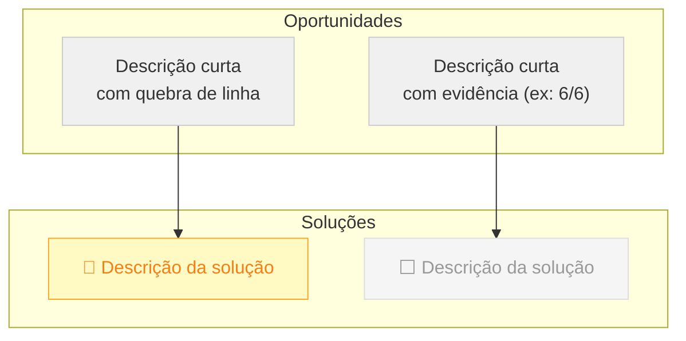

# OST — Opportunity-Solution Tree

Skill para criar, analisar e visualizar árvores de oportunidade (Teresa Torres) a partir de dados de Discovery, documentos de estratégia ou entrevistas com usuários.

## Quando usar

- Usuário quer criar uma OST a partir de Discovery/entrevistas/roadmap existente
- Usuário quer migrar de modelo centrado em roadmap para modelo centrado em oportunidades
- Usuário quer mapear iniciativas existentes a oportunidades e identificar gaps
- Usuário quer visualizar uma OST com diagramas

## Estrutura de uma OST

Toda OST tem 3 camadas, top-down:

```
🎯 Outcome (métrica de resultado, não de output)
├── Oportunidade 1 (problema/dor real, com lead indicator)
│   ├── Solução A (linkada à oportunidade)
│   └── Solução B
├── Oportunidade 2
│   └── Solução C
└── ...
```

### Outcome

- **Um** outcome por árvore
- Mede **resultado no mundo real**, não % de feature concluída
- Exemplos bons: "% de crianças com PEI aderente em X dias", "Tempo mediano entre indicação e início da intervenção"
- Exemplos ruins: "Robustez na escolha de objetivos", "Processo padronizado" (medem output, não outcome)

### Oportunidades (espaço do problema)

- Devem vir de **evidência**, não de suposição: entrevistas, dados, observação
- Cada oportunidade tem um **lead indicator**: métrica intermediária que sinaliza se está sendo atacada
- Marcar nível de confiança quando possível (ex: "confirmado por 6/6 OGs")
- Oportunidades sem evidência são suposições — marcar como tal

### Soluções (espaço de solução)

- Linkadas às oportunidades que atacam
- Uma solução pode atacar múltiplas oportunidades (isso é um sinal de alavancagem)
- Marcar status: ✅ pronto, 🔄 em andamento, ⬜ não iniciado
- Nem toda oportunidade precisa ter solução mapeada — gaps são informação valiosa

## Fluxo de criação

### Passo 1: Coletar contexto

1. Ler todos os documentos relevantes (Confluence, Slack, entrevistas, roadmap)
2. Documentar no arquivo `1-contexto.md`:
   - Origem da iniciativa
   - Roadmap/objetivos atuais
   - Mudanças e pivôs desde a definição inicial
   - Resumos dos documentos de Discovery

### Passo 2: Analisar evolução do entendimento

Criar `2-analise-evolucao-entendimento.md`:
- Comparar objetivos iniciais com o que os documentos posteriores revelaram
- Identificar premissas que foram invalidadas
- Mapear pivôs e mudanças de escopo
- Identificar métricas sujas ou não confiáveis
- Documentar padrões transversais

### Passo 3: Analisar formulação dos objetivos

Criar `3-analise-inicial-okrs.md`:
- Criticar objetivos que medem output em vez de outcome
- Propor alternativas centradas em resultado
- Mostrar como a formulação afeta o comportamento do time

### Passo 4: Criar a OST

Criar `4-ost.md` com:

1. **Outcome** — um parágrafo explicando a escolha
2. **Oportunidades** — tabela com #, descrição, fonte (de onde veio a evidência), lead indicator. Agrupar por temas (A, B, C...) para navegabilidade.
3. **Soluções** — árvore de texto com indentação, cada solução linkada à oportunidade, com status
4. **Diagramas** — Mermaid por tema (ver seção abaixo)
5. **O que NÃO está na árvore** — escopo excluído conscientemente e por quê
6. **Próximos passos** — roteiro de validação com o time, como priorizar, experimentos antes de builds
7. **Relação com roadmap atual** — tabela mapeando iniciativas do roadmap às oportunidades, com lead indicators

## Diagramas Mermaid

### Regra de ouro: quebrar diagramas grandes

Se a OST tem mais de 10 nós, **nunca** colocar tudo em um único diagrama. Fica comprimido e ilegível. Em vez disso:

1. **1 diagrama de visão geral**: Outcome → temas (horizontal, `flowchart LR`, só os temas, sem soluções)
2. **1 diagrama por tema**: Oportunidades → Soluções (vertical, `flowchart TD`, com subgrafos separando OPS de SOL)

### Padrão de código



### Cores de status

| Status | Classe | Cor | Emoji |
|---|---|---|---|
| Pronto | `done` | Verde (#c8e6c9) | ✅ |
| Em andamento | `prog` | Amarelo (#fff9c4) | 🔄 |
| Não iniciado | `todo` | Cinza (#f5f5f5) | ⬜ |

## Convenções de arquivos

- Usar numeração sequencial no nome: `1-`, `2-`, `3-`, `4-`
- A numeração reflete a ordem de leitura (contexto → análise → OST)
- Salvar em `documentations/<iniciativa>/`
- Commit com prefixo `docs(<iniciativa>):`

## Pitfalls

- **"Robustez" como objetivo**: é métrica de output disfarçada. Sempre questionar se o objetivo mede resultado real ou % de features concluídas.
- **OST como artefato definitivo**: a OST é ponto de partida para conversa com o time, não verdade final. Sempre incluir roteiro de validação.
- **Outcome genérico demais**: se o outcome serve para qualquer time/produto, está errado. Precisa ser específico do domínio.
- **Oportunidades sem evidência**: se uma oportunidade não tem fonte (entrevista, dado, observação), marcar como suposição.
- **Diagrama único com 20+ nós**: sempre quebrar em visão geral + por tema.
- **Confluence whiteboards**: a API do Confluence não retorna conteúdo completo de whiteboards. Usar `searchConfluenceUsingCql` com `type=whiteboard` para acessar o excerpt indexado. Se o excerpt estiver vazio, pedir ao usuário para descrever o conteúdo. Ver `references/confluence-whiteboards.md`.
